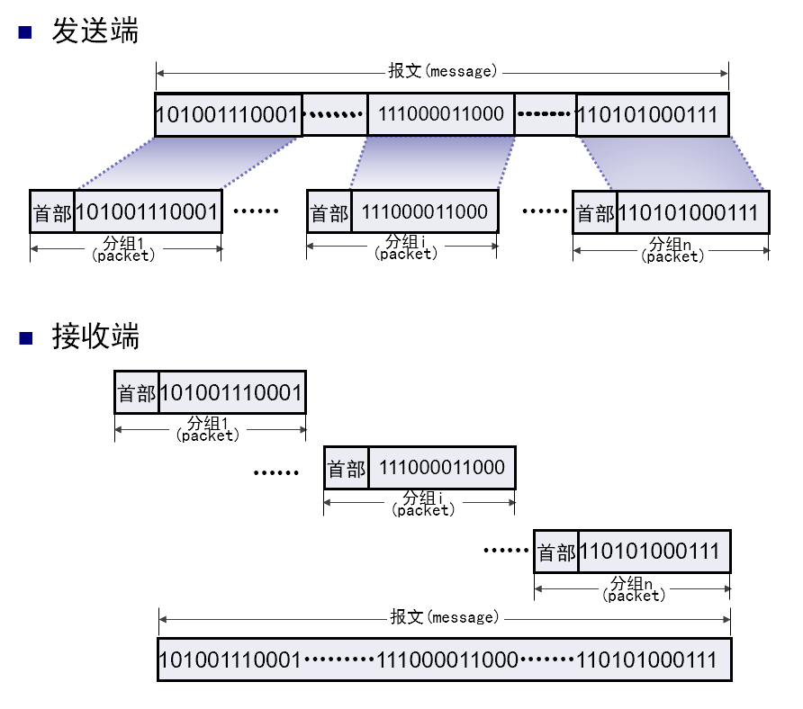
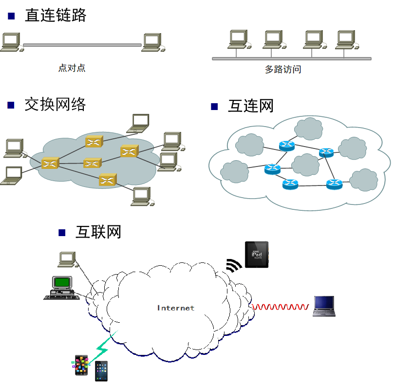
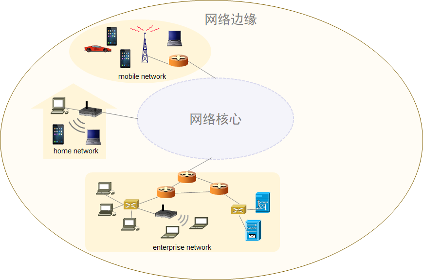
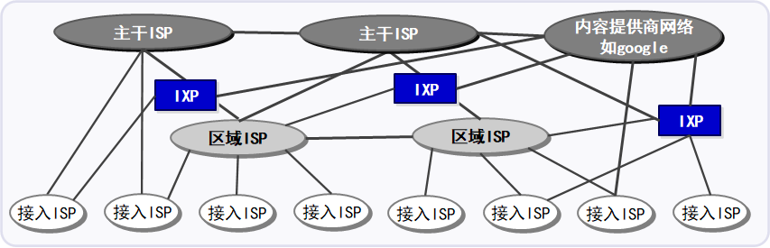
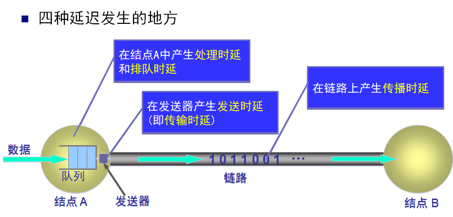
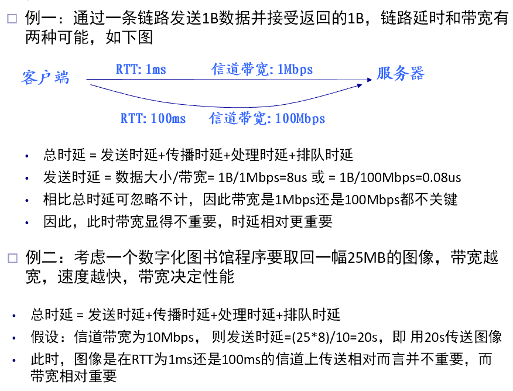
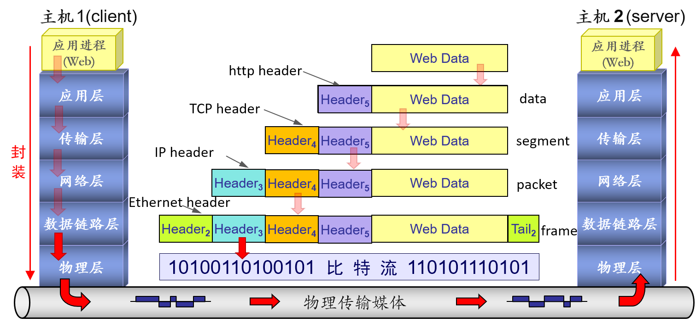
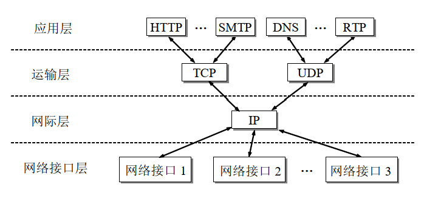

# Chapter 1 计算机网络概述

## 导读

| Item     | Content                                                                                                                                                                                                                                                                      |
| -------- | ---------------------------------------------------------------------------------------------------------------------------------------------------------------------------------------------------------------------------------------------------------------------------- |
| **内容** | 计算机网络的起源与发展, Internet 的组成, 计算机网络的性能, 计算机网络体系结构                                                                                                                                                                                                |
| **要求** | **掌握**: 计算机网络的组成; 分组交换原理; 计算机体系结构的演变思路与历程; 网络性能评价的指标与方法; 端-网-云结构的转变与形成 **理解**: 电路交换与报文交换的基本原理 **了解**: 计算机网络从需求到产生的基本过程; 计算机网络协议的标准化组织及标准的几种形态和转换过程 |
| **重点** | 计算机网络的起源, 组成, 理论基础, 性能评价及体系结构                                                                                                                                                                                                                         |
| **难点** | 对总体通信时延的理解; 分层体系结构中层间协作的基本原理; 对时延带宽积的理解                                                                                                                                                                                                   |

## 1.1 计算机网络的起源与发展

> 计算机网络领域知识中的常见路线:
>
> 基本机制 → (大规模) → 分布式情形 → (新的问题) → 优化 → ...
>
> 因此, 很多机制的实现都是打了很多次 "补丁" 之后的结果

### 组成信息网络：交换

#### 电路交换 (Circuit Switching)

##### 电路交换的概念

电路交换是面向连接的交换方式, 也就是只有在建立连接之后才能开始信息交换.

当电路交换中的主机数量增加, 就引入了**交换机** (switch) 来完成全网的交换任务, "交换" 意为动态分配通信资源.

{: style="height:200px" align=right}

##### 电路交换的步骤

- 建立连接 (开始占用通信资源)
- 通话 (持续占用通信资源)
- 释放连接 (归还通信资源)

##### 电路交换的特点

以电路交换方式传送计算机数据效率低.

原因:

- 计算机数据具有突发性 (burst), 传送数据的时间不到 10% ，甚至低于 1%;
- 面向连接的方式进行传输导致资源浪费, 因为被占用的通信线路绝大部分时间空闲

#### 分组交换 (Packet Switching)

##### 分组交换的概念

将 message 分为 packet, 并在首部加上控制信息, 然后分别逐跳转发到目的端.

##### 分组交换的步骤

**发送端**:

1. 把较长的报文划分成较短的, 固定长度的数据段
2. 每一个数据段前面添加上首部 (header) 构成分组 (Packet)

   - 分组是互联网中传送的数据单元
   - 每个首部都包含地址等**控制信息**

3. 依次把各分组发送出去

**中间结点**:

1. 以**存储转发**的形式将分组**逐跳**转发至目的端

> **中间结点**, 即分组交换网络中的分组交换机. 两种最著名的类型:
>
> - 二层交换机 (link-layer-switch), 可以实现本地转发
> - 路由器 (router, 有时也称三层交换机), 可以实现远地转发
>
> **路径** (route/ path) : 一个分组经历的一系列分组交换机和通信链路称为通过该网络的路径.

**接收端**:

1. 收到分组后, 剥去分组的首部, 把数据恢复成为原来的报文
   - 这里我们假定分组在传输过程中没有出现差错, 在转发时也没有被丢弃

{: style="height:300px" align=right}

##### 分组交换的特点

**优点**:

- 高效: 动态分配传输带宽，对通信链路**逐段占用** ，充分使用链路的带宽
- 灵活: 以分组为单位，查找路由和传送
- 迅速: **不必先建立连接**就能向其它主机发送分组
- 可靠: 自适应的路由选择，使网络有很好的生存性

**问题**:

- 时延
  - 处理时延: 逐跳决策, 每个中间结点都需要进行路由查找
  - 排队延时：分组在各结点存储转发时需要排队
- 附加开销
  - 分组必须携带报头（首部），造成一定开销

> 在分组交换中, 路径不必相同, 但是在短时间内可以认为每一个节点的数据路径稳定 (实际上稳定性并不是必需的属性).

#### 比较: 三种交换

{: style="height:300px"}

- **电路交换**: 面向连接, 全程连续传输, 像通过一个 "固定" 的 pipe
- **报文交换**: 整个报文的存储转发
- **分组交换**: 报文分组, 单组存储转发

### 计算机网络中的基本概念

#### 绘制网络的基本元素

**链路** (link): 从一个结点到**相邻结点**的一段物理线路 (有线或无线), 而中间没有任何其他的交换结点.

**路径/ 路由** (Path/ Route): 任意两点间/ 远端之间的连接线路, 可变.

> 网络连通有不同的层次，最底层是一个或多个计算机通过物理介质[^1] 直连.

**结点** (node): 被连接的计算机/ 其它硬件, 分两类

- 主机 (端系统): 传统 PC, 服务器, 智能手机, 智能家电, 传感设备等
- 网络内部交换结点：二层交换机, AP, 基站, 路由器等

**云形图**: 计算机网络中重要的图标，表示任意类型的网络, 将网络的内部结点与使用网络的外部结点区分开来

#### 不同类型的网络连接结构

{: style="height:400px" align=right}

**直连链路**: 所有的结点都是直连 (直接连通) 的

**交换网络**: 由若干结点和链路组成，主机间接连通

- 主机 (host): 支持用户运行应用程序
- 交换结点 (switch): 存储和转发分组

**互连网** (internet): 网络的网络, 由路由器将网络和网络互连而成

- 网络可以由网络的嵌套构成; 通过将云互联成更大的云，递归构建任意大的网络

**互联网** (Internet): 起源于美国, 已发展成为世界上最大的国际性计算机互联网

- 根本性创新：将区别很大的不同类型的网络[^2]互联
- 既是概念, 也是实例

### Internet 发展历程

> 序幕: ARPAnet 诞生

#### 第一发展阶段: 从专用网络向互联网发展

#### 第二发展阶段: 建成三级结构的 Internet

{: style="height:130px" }

- 三级: 主干网 - 地区网 - 校园网/企业网
- 网络间通过路由器连接, 主机到主机的通信可能经过多种网络

#### 第三发展阶段: 逐渐形成多层次 ISP 结构的 Internet

{: style="height:130px"}

- **ISP** (Internet Service Provider): Internet 服务提供商, 如中国电信/联通/移动
- **多宿** (multi-home): ISP 与两个或更多提供商 ISP 连接，保障可靠性; 任何 ISP (除了第一层 ISP) 都可选择多宿
- **对等** (peer): 对等方的网络直接相连，不经过上级 ISP, 且相互之间无需结算和付费
- **IXP** (Internet Exchange Point，peer) 由第三方公司创建, 相当于网络中的 "汇合点" ，多个 ISP 能在这里共同对等 (成为 peer)

### Internet 的标准化工作\*

Internet 标准制定的四个阶段:

- 草案 (Internet Draft): 这个阶段还不是 RFC 文档, 有效期 6 个月
- 建议标准(Proposed Standard): 从这个阶段开始就成为 RFC (Request For Comments) 文档
- 草案标准(Draft Standard)
- 互联网标准(Internet Standard)

## 1.2 Internet 的组成

经典的 Internet 由网络边缘和网络核心组成:

- **网络边缘**: 主机(端系统), 接入网
- **网络核心**: 分组交换机和链路构成的网状网络, 它向网络边缘的大量主机提供连通性

如今, 实际的 Internet 演变为 **"端-网-云"** 结构.

### 网络边缘

#### 端系统 (End System)

端系统, 即因特网上的所有主机, 亦即网络边缘的所有主机组成的系统.

##### 端系统间的通信方式

###### 客户-服务器方式 (C/S, Client/Server)

{: style="height:200px"}

C/S 描述的是进程之间服务和被服务的关系, **客户** (client) 和**服务器** (server) 指通信中涉及的两个应用进程.

| Item           | 客户端                                                         | 服务器                                                                                                                                                |
| -------------- | -------------------------------------------------------------- | ----------------------------------------------------------------------------------------------------------------------------------------------------- |
| **定义**       | 服务的请求方                                                   | 服务的提供方                                                                                                                                          |
| **行为**       | 被用户调用后运行打算, 通信时主动向远地服务器发起通信(请求服务) | 专门用来提供某种服务的程序, 可同时处理多个远地或本地客户的请求;  系统启动后即自动调用并一直不断地运行着, 被动地等待并接受来自各地的客户的通信请求, |
| **对方的地址** | 必须知道服务器程序的地址                                       | 不需要知道客户程序的地址                                                                                                                              |
| **底层支持**   | 不需要特殊的硬件和很复杂的操作系统                             | 一般需要强大的硬件和高级的操作系统支持                                                                                                                |

###### 对等方式 (P2P, Peer to Peer)

{: style="height:200px"}

采用 P2P 模式的通信中, 两个主机不区分服务请求方和服务提供方, 进行平等且对等的连接通信.

其本质仍然是使用 C/S 方式, 但是对等连接中的每一个主机既是客户同时又是服务器.

相比 C/S 架构, P2P 方式的优势会在性能瓶颈和单点故障时体现出来.

#### 接入网 (Access Network)

{: style="height:200px"}

**接入网**: 将端系统连接到**边缘路由器** (edge router)[^3] 的物理链路.

常见的接入网使用环境: 家庭/企业接入 (数字用户线, 电缆, 光纤, LAN[接入以太网], WLAN[接入 Wi-Fi], etc), 广域无线网络接入 (如 4G/5G).

### 网络核心

**网络核心**是互联端系统的**分组交换机**和**链路**构成的网状网络, 向网络边缘中的大量主机提供连通性 (非具体业务)

#### 分组交换机

**分组交换机**以存储转发传输模式对分组进行传输, 依据传输时转发所在的层次可以分为两类:

- 路由器 (三层交换机)
- 二层交换机

#### 网络核心组成

{: style="height:150px"}

网络核心由十多个第一层 ISP 和数十万个较低层 ISP 组成.

> 除去前面提到的基本的多层 ISP 结构, **内容提供商** (如上图中的 Google) 也创建自己的网络，直接在可能的地方与 ISP 互联.

## 1.3 计算机网络的性能

### 性能指标

#### 速率 (data rate)

一般以**数据率**(data rate) / **比特率**(bit rate) 衡量.

网络技术中, **数据率**即数字信道上传送数据的速率.

单位: b/s (bit/s, bps), kb/s, Mb/s, Gb/s, Tb/s

#### 带宽 (bandwidth)

计算机网络中, **带宽**即数字信道所能传送的 "最高数据率".

> 在通信领域, "带宽" (bandwidth)本来是指信号具有的频带宽度, 单位是 Hz.

网络的带宽: 在一段特定的时间内网络所能传送的比特数.

#### 吞吐量 (throughput)

**吞吐量**: 单位时间内通过某个网络 (或信道, 接口) 的数据量.

> **比较**: 带宽 vs 吞吐量
>
> | 带宽                               | 吞吐量                                         |
> | ---------------------------------- | ---------------------------------------------- |
> | 一般指链路上每秒**能**传输的比特数 | 表示系统的测量性能，即每秒**实际**传输的比特数 |
>
> 例如 : 一段带宽为 10 Mbps 的链路连接的一对节点可能只达到 2 Mbps 的吞吐量.

计算吞吐量: $\text{Throughput} = \frac{\text{Transfer Size}}{\text{Transfer Time}}$,

- Transfer Size: 传输的数据大小,
- **Transfer Time**: $=\text{RTT} + \frac{\text{Transfer Size}}{\text{Bandwidth}}$
  - 发送请求并返回数据的时间 = RTT,
  - 把数据传到网上的时间 = $\frac{\text{Transfer Size}}{\text{Bandwidth}}$,

> 化简可得:
>
> $$
> \text{Throughput}
> = \frac{\text{Transfer Size}}{\text{RTT} + \frac{\text{Transfer Size}}{\text{Bandwidth}}}
> \\=\frac{1}{\frac{\text{RTT}}{\text{Transfer Size}} + \frac{1}{\text{Bandwidth}}},
> $$
>
> 因此, 传输更大量的数据 (RTT 和 Bandwidth 基本固定不变, Transfer Size 增加) 有助于提高吞吐量.
>
> 由于
>
> $$
> \lim_{\text{Transfer_Size}\rightarrow +\infty}\frac{1}{\frac{\text{RTT}}{\text{Transfer Size}} + \frac{1}{\text{Bandwidth}}}=\text{Bandwidth},
> $$
>
> 可知: 当数据量趋于无限大时, 吞吐量将接近网络带宽

#### 时延/延迟 (latency/delay)

**发送时延**: 发送数据时，数据块**从结点进入到传输介质**所需要的时间[^4] .

$$
\text{发送时延} = \frac{\text{数据块长度 (单位: b)}}{\text{发送速率 (单位: b/s)}}
$$

**传播时延**: 电磁波在信道中需要传播一定的距离而花费的时间.

$$
\text{传播时延} = \frac{\text{信道长度 (单位: m)}}{\text{信号在信道上的传播速率 (单位: m/s)}}
$$

> - 在不同介质的信道中, 电磁波的传播速度不同.
>   - 例如: 光纤 $2\times 10^8$ m/s, 电缆 $2.3\times 10^8$ m/s.
> - **信号传输速率 (即发送速率)** 和**信号在信道上的传播速率**是完全不同的概念
>   - **信号传输速率**: 发送速率, 从端推入链路的速率, 与带宽有关
>   - **信号在信道上的传播速率**: 在链路上传播的速率

**处理时延**: 主机或路由器在收到分组时进行一些必要的处理所花费的时间.

> 例如: 分析分组首部, 差错检验, 查找路由等过程

**排队时延**: 结点缓存队列中分组排队所经历的时延.

> 排队时延的长短, 往往取决于网络中当时的通信量.

##### 比较: 四种延迟

###### 产生延迟的位置

{: style="height:200px"}

###### 四种延迟的定义比较

| Item                | 定义                       | 备注                     |
| :------------------ | -------------------------- | ------------------------ |
| 传输时延 (发送时延) | 数据包大小 $\div$ 带宽     | 从结点发到链路上的用时   |
| 传播时延            | 距离 $\div$ 速度           | 与线路的**物理特性**有关 |
| 处理时延            | 在结点处处理 packet 的时间 |                          |
| 排队时延            | 在结点的 buffer 队列排队   |                          |

**注意**:

- 对于高速网络链路，我们提高的仅仅是数据的**发送速率**, 而不是比特在链路上的传播速率,
  - 提高链路带宽 = 降低数据的发送时延;
- 若要提高传播速率, 应当换用物理传播速率高的物理传播介质.

##### 链路/信道的性能特征: 带宽 & 时延

**带宽**和**时延**结合起来,定义了一个**给定链路或信道**的**性能特征**.

二者相对的重要性依赖于应用, 即: 需要看具体的传输条件.

分析具体问题时, 需要考虑四项时延中的哪一项起主要作用.

> **例** (带宽与时延)
>
> {: style="height:310px"}

#### 时延带宽积 (Bandwidth-delay Product)

> 时延和带宽共同定义了信道的传输性能, 那么, 是否存在能将他们结合起来的物理量呢?

**时延带宽积** $=\text{时延}\times\text{带宽}$, 又称为以比特为单位的链路长度, 表示 "在发送端**发送 1 bit**到**这个 bit 被接收**的这段时间内，**一共发送了多少个 bit**". 这个数据总长度表示了**链路上某时所能容纳的最大 bit 数**, 亦即 **链路上已发送但尚未确认的数据**。

如果将一对进程之间的**信道**看成一个中空的**管道**, **时延**相当于管道的长度, **带宽**相当于管道的截面积, 那么**时延和带宽的积**就是管道的**容积,** 即**链路上所能容纳的比特数**.

{: style="height:80px"}

**管道中的比特数**表示**从发送端发出的尚未达到接收端的比特**, 对于一条正在传送数据的链路, 只有在代表链路的管道都充满比特时, 链路才得以充分利用.

> 所以, 如果你愿意, 可以把这个量看做链路的 "容积".

#### 往返时间 RTT

> 往返时间 (RTT, round-trip time) 是一个用来帮助了解单次交互时间的量.

| Item    | 定义                                                                                                                  |
| ------- | :-------------------------------------------------------------------------------------------------------------------- |
| 时延    | 数据从网络的一端**传送**到另一端所需花费的时间 &nbsp;&nbsp;&nbsp;&nbsp;从结点到结点单程数据传输全过程所花费的时间 |
| **RTT** | 数据从网络的一端传到另一端**并返回**所花费的时间 &nbsp;&nbsp;&nbsp;&nbsp;数据在链路上花费的时间                   |

**RTT** 通常认为是 $\text{传播时延}\times 2+\text{末端处理时间}$, 其中 $\text{末端处理时间}$ 常常被忽略.

它的计时范围可以简单理解为 **"从 [A 将数据发送到 B] 到 [A 确认信息已经发送到 B]"**.

因为 RTT 和传播时延强相关, 所以可以认为 RTT 是一个与线路物理特性非常相关的量.

#### 利用率

##### 信道利用率

**信道利用率**: 信道有百分之几的时间是被利用的[^5] .

> 完全空闲的信道, 其信道利用率为 0.

{: style="height:150px" align=right}

**信道利用率并非越高越好**. 根据排队论的理论, 当某信道的利用率增大时, 该信道引起的**时延**也就迅速增加.

令 $D_0$ 表示网络空闲时的时延, $D$ 表示网络当前的时延, $U\in[0,1]$ 表示信道利用率, 则在适当的假定条件下, 当前时延可以这样计算:

$$
D=\frac{D_0}{1-U},
$$

从该式中可以看到, **当利用率增加时, 时延也将迅速增加**.

##### 网络利用率

**网络利用率**: 全网络的信道利用率的加权平均值, 即 $\frac{\sum\text{信道利用总量}}{\sum\text{总信道容量}}$.

> 实际上这是一个很难真实计算的值, 但以其为指导发展了基于负载均衡的 "流量工程" 方向.

### 计算机网络的非性能特征

费用, 质量, 标准化, 可靠性, 可扩展性和可升级性, 易于管理和维护...

## 1.4 计算机网络体系结构

### 协议与划分层次

**网络协议** (network protocol): 为进行网络中的数据交换而建立的规则, 标准或约定.

> 网络协议等规则明确规定了所交换的数据的格式以及有关的同步问题; 这里的同步是广义的, 含有时序的意义.

**网络协议的三要素**:

- 语法: 数据与控制信息的结构或格式
- 语义: 需要发出何种控制信息, 完成何种动作, 做出何种响应
- 同步: 事件实现顺序的详细说明

**分层网络模型** (layered Network Model) 将通信网络中的工作分为若干层次, 使得每一层次利用下层提供的服务实现一些服务, 以便本层向上层或向用户提供服务.

> 理论模型: 开放系统互联 (OSI，Open Systems Interconnection) 参考模型
>
> 实际架构: 互联网体系结构 (**TCP/IP 体系结构**）

- 分层的优点: 层间独立/灵活性好/ 结构上易分割/ 易于实现&维护/ 能促进标准化
- 分层的缺点: 一些功能在不同层次重复出现, 产生额外开销, etc

各层完成的功能主要有:

- 差错控制
- 流量控制
- 分段-重装 (数据块的划分)
- 复用-分用 (连接的复用)
- 建立连接-释放连接

**计算机网络的体系结构**(computer network architecture): 计算机网络的各层及其协议的集合, or say, 这个计算机网络及其构件所应完成的功能的精确定义[GREE82].

> 体系结构是抽象的, 实现则是具体的软硬件.

### 具有五层协议的体系结构

| 层次   | 任务                                                     | 例子                                   | 协议数据单元 (PDU)                                       |
| ------ | -------------------------------------------------------- | -------------------------------------- | -------------------------------------------------------- |
| 应用层 | 通过**应用进程间的交互**完成特定的网络应用               | 域名系统 DNS, HTTP, SMTP               | 报文/message                                             |
| 运输层 | 向**两台主机中进程之间的通信**提供**通用的数据传输**服务 | 传输控制协议 TCP 用户数据报协议 UDP | TCP: 报文段 (segment) UDP: 用户数据报 (user datagram) |
| 网络层 | 为分组交换网上的**不同**主机提供通信服务                 | TCP/IP 体系中的网际协议 IP             | 分组 (IP 数据报/ 数据报) or 包 (packet)                  |
| 链路层 | 为**链路上的数据传输**提供服务 (\*)                      |                                        | 帧 (frame)                                               |
| 物理层 | 为**物理媒介上的数据传输**提供服务 (\*)                  |                                        | bit?                                                     |

#### 关于网络体系结构各层次的补充说明

1. **应用层** (application layer): 定义应用进程间通信和交互的规则;
2. **运输层** (transport layer):
   1. 传输控制协议 TCP (Transmission Control Protocol) 提供**面向连接的** & **可靠的**数据传输服务;
   2. 用户数据报协议 UDP (User Datagram Protocol) 提供**无连接的** & **尽最大努力的** (best-effort) 数据传输服务 (不保证数据传输的可靠性);
3. **网络层** (network layer): 以互联网为例, 互联网的网络层协议是无连接的网际协议 IP (Internet Protocol) 和许多种路由选择协议
4. **数据链路层** (data link layer):
   1. 将网络层交下的 IP 数据包组装 (framing) 为帧;
   2. 在相邻结点间的链路上传送帧;
5. **物理层** (physical layer):
   1. 物理层考虑物理量与信息的 1 bit 的 '0' 和 '1' 对应的关系和 'bit' 的识别等;
   2. 物理层不考虑 bit 的解释;
   3. 物理层的协议**不包括**物理媒介, 物理媒介在物理层的更下层.
6. TCP/IP 协议不一定单指 TCP 和 IP 这两个具体协议, 而是常常表示整个 TCP/IP 协议族;
7. 某一层次的**协议数据单元** (PDU): 对等层次 (peer layer) 之间传送的数据单位.

#### 数据在各层次之间的传递过程示意图

{ : style="height:250px"}

> 注意: 传送比特流时, 应从**首部**开始传输.

### 实体, 协议, 服务和服务访问点 (SAP)

**实体** (entity): 任何可以发送或接收信息的硬件或软件进程.

**对等实体** (peer entity): 位于不同系统的**同一层**内相互交互的实体.

**网络协议**: 为进行网络中的数据交换建立的规则, 标准或约定, 控制两个**对等实体**进行通信的规则的集合.

网络协议的**层次**: 一台机器上的第 N 层与另一台机器上的第 N 层对话所使用的若干规则称为第 N 层协议.

{ : style="height:150px"}

**服务** (service): 由下层向上层通过层间接口提供.

**服务接口**: 同一系统上/ 下层之间的协议.

**服务访问点/ SAP** (Service Access Point): 同一系统相邻两层的实体进行交互的地方.

**服务数据单元/ SDU** (Service Data Unit): 层之间交换数据的单位.

> **SDU** 区别于同层的 'PDU', 并且不一定要与 PDU 相同, 可以是多个 SDU 组成 PDU or 多个 PDU 组成 SDU.

#### 比较: 协议 vs 服务

| Item | 区别                                     | 联系                                           |
| ---- | ---------------------------------------- | ---------------------------------------------- |
| 协议 | 控制对等实体之间的通信, i.e. 同一层内    | 协议控制本层的通信行为, 使其能向上一层提供服务 |
| 服务 | 下层向上层提供; 第 N 层向第 (N+1) 层提供 | 为实现本层的协议, 需要使用下一层提供的服务     |

### TCP/IP 体系结构

细腰结构 (narrow-waist) 是网络体系结构模型中最典型的特征.

TCP/IP 协议可以为各式各样的应用提供服务 (所谓的 everything over IP), 同时 TCP/IP 协议也允许 IP 协议在各式各样的网络构成的互联网上运行 (所谓的 IP over everything).

{ : style="height:180px"}

## 更多

计算机网络系统设计准则:

- R. Bush and D. Meyer. Some Internet Architectural Guidelines and Philosophy. IETF RFC 3439, Dec. 2003.
- J. Saltzer et al.. End-to-end arguments in system design. ACM Transactions on Computer Systems (TOCS), 1984, 2(4): 277-288.

互联网细腰模型及演化:

- S. Akhshabi et al. The Evolution of Layered Protocol Stacks Leads to an Hourglass-Shaped Architecture. ACM SIGCOMM 2011.
- L. Popa et al. HTTP as the Narrow Waist of the Future Internet. ACM HotNets 2010.

## 参考文献和资料

1. [时延，时延带宽积，RTT 与利用率 - 终究浮光掠影 - 博客园](https://www.cnblogs.com/PeterShang008/p/13381295.html)
2. [带宽时延乘积 - 维基百科，自由的百科全书](https://zh.wikipedia.org/wiki/带宽时延乘积)

<!-- Footnotes -->

[^1]: 物理直连介质, 主要有同轴电缆、铜线、光纤、无线电频谱等
[^2]: 网络类型举例: 有线网络, 无线局域网, 4G/ 5G, 传感网 ……
[^3]: 边缘路由器: 端系统到任何其它远程系统的路径上的第一台路由器
[^4]: 即从发送第一个比特起，到最后一个比特发送完毕所需的时间
[^5]: 信道被利用 = 有数据通过信道
