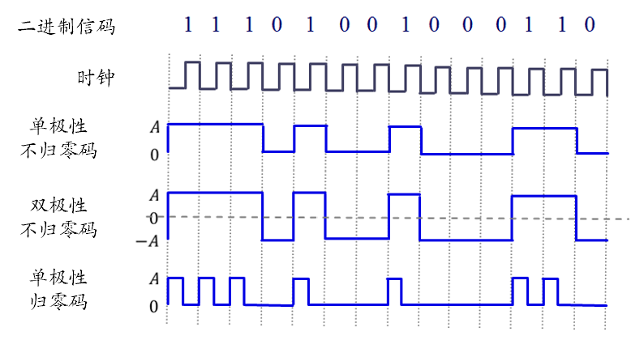
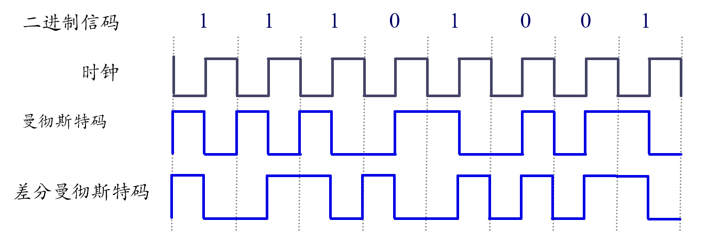
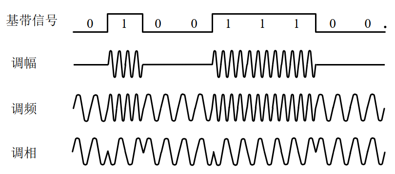
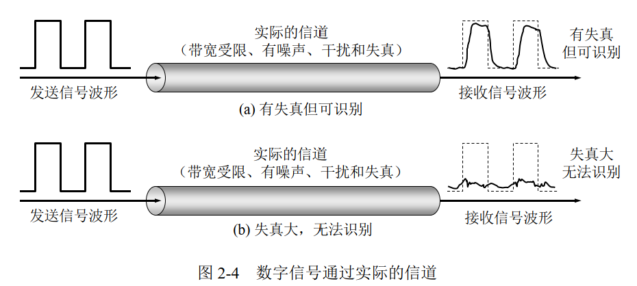
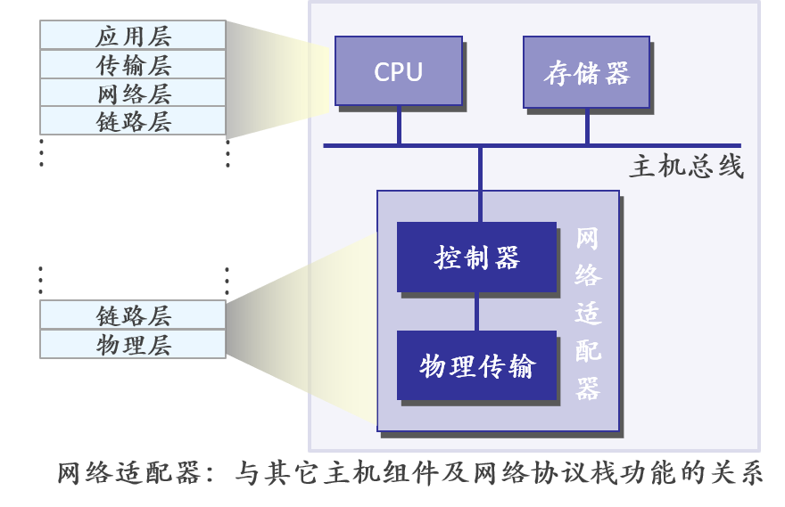
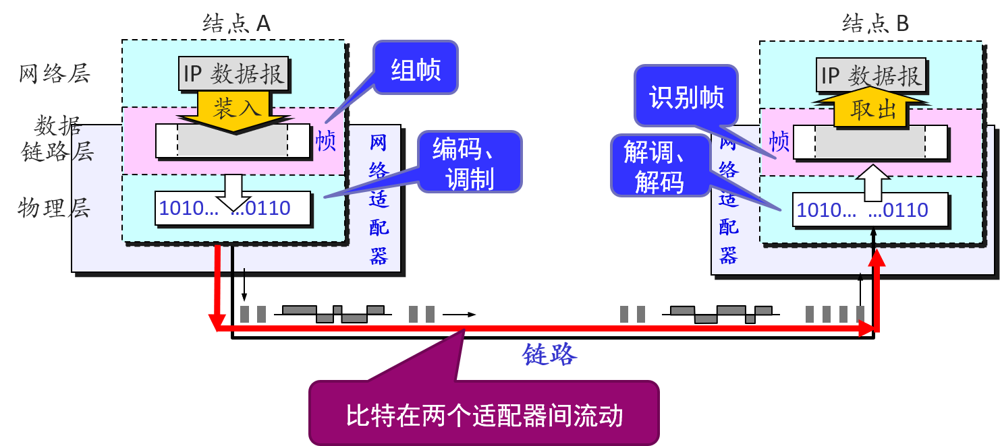
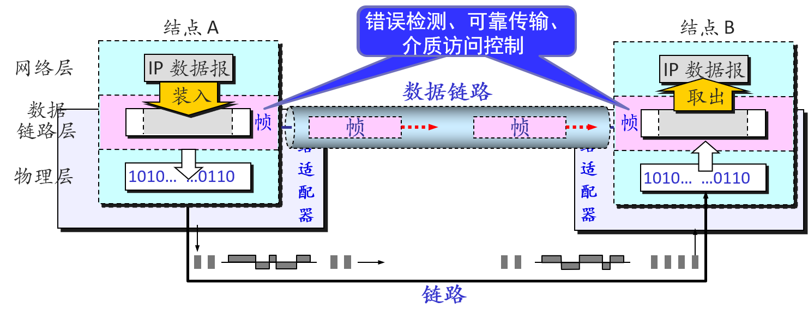

# Chapter 2 直连网络

## 导读

## 2.1 数据通信的基本概念

### 概念: 信息与信号

**信息** (message): 语音/ 文字/ 图像/ 视频等, 通信的目的即为传送信息.

**数据** (data): 运送消息的载体, 有意义的符号序列.

**信号** (signal): 数据的电气/ 电磁表现.

- **模拟信号** (analogous): 代表消息的参数的取值是连续的.
- **数字信号** (digital): 代表消息的参数的取值是离散的.

**码元** (code): 在使用时域波形表示数字信号时, 代表不同离散数值的基本波形; 如二进制编码时, 常用两种码元, 分别表示 0 状态和 1 状态. 若码元离散状态有 $M$ 个, 则称为 "$M$ 进制码元", 这里的 $M$ 满足 $\exists n \in \mathbb{N}, M=2^n$.

### 概念: 通信与信道

**单工通信** (simplex): 通信双方设备中发送器与接收器分工明确, 只能在由发送器向接收器的单一固定方向上传送数据, 没有反向交互; 如:无线电广播.

**半双工通信** (half-duplex): 通信双方设备既是发送器, 也是接收器, 两台设备可以相互传送数据, 但某一时刻则只能向一个方向传送数据; 如总线型以太网, 802.11WLAN

**全双工通信** (duplex): 通信的双方可以同时发送和接收信息, 通信双方设备既是发送器, 也是接收器, 两台设备可以同时在两个方向上传送数据; 如电话, 交换以太网.

**基带信号**: "基本频带信号", 来自信源的原始信号, 未经过调制 (频谱搬移和变换). 长距离或无线信道中, 无法直接传输基带信号 (基带信号频率较低, 含有较多的低频成分甚至直流成分), 需要进行**调制**.

- 其特点是**频率较低**, 信号频谱从零频附近开始, 具有低通形式. 基带信号分为数字基带信号和模拟基带信号
- 近距离范围内基带信号的衰减不大, 可以采用基带传输. 比如: 计算机到监视器, 打印机等外设, 以太网等局域网

### 调制

**调制** (modulation): 将基带信号变换方式后进行传输, 其目的有:

- 将信号变换为便于传送的形式, 比如:
  - 无线传输时需要将信号搬到高频上才能在自由空间发送出去
  - 数字电话中将连续信号变换为脉冲编码调制信号
- 有效利用频带.

**调制的种类**:

- 编码调制: 对波形进行变换, 数字信号转换为另一种形式的数字信号, 适应信道特征.
  - 进行编码调制后, 得到的是基带信号, 故也称为基带调制.
- 带通调制: 使用载波, 把基带信号的频率搬到高频, 转换为模拟信号, 也成为载波调制.

#### 编码调制

二进制数据转变为可在链路上传输的电磁波信号, 可分为两层考虑:

- 上层, 编码调制: 发送端把二进制数据 (比特) 编码为数字基带信号, 接收端再解码为比特
- 下层, 带通调制: 将编码后的基带信号调制为在相应传输介质易于传输的信号形式

##### 数字基带信号的码型

数字基带信号码型种类繁多, 根据码元幅度取值不同分为:

- 二元码: (+, 0) 最简单的波形为矩形, 幅度只取 0, 1 两种电平
- 三元码: (+, 0, -) 从二元码的单极限变为三元码的双极性, 但不是二进制变三进制, 故也称为"准(伪)三元码"
- 多元码: $n$ 位二进制组码, 可用 $M=2^n$ 元码传输, 信道利用率可提高 $n$ 倍; 每个符号可以用来表示一个二进制组码, 成倍提高了频带利用率.

> 以同样的码元速率发送信息, 相同时间内 $2^n$ 元码方式传送的信息量将提高到二元码的 $n$ 倍.

##### 码型设计原则

- **透明**: 码型变换过程对任何信源透明, 与任何信源统计特性无关 (算是一种通用性?)
- **同步**: 从传输码型中易于提取出时钟, 以便发送方和接收方的时钟同步, 从而保证编码和解码过程中使用一个时钟驱动, 使之得到的结果正确
- **自检**: 具有自检能力, or say 码元间有相关性 (=信息有冗余度, 因为码元相互间不再独立, 也即各码元所含的信息量不为最大)
- 误码增值越小越好
- 编/译码器简单方便
- **一一对应**:编码有唯一可解性, 可还原出唯一的原二进制序列

##### 二元码举例

{ : style="height:220px"}

上图中展示了几种最基本的二元码, 可以看到, 这几种码中存在大量直流分量, 并且在长串不变值下呈现固定连续电平, 不出现跳变, 无法提取时钟信号, 因此仅能用于机内 or 近距离的信息传递, 不能上信道.

{ : style="height:150px"}

**曼彻斯特码**: 一个周期的方波表示 "1" ; 反向波形表示 "0".

> 曼彻斯特编码是没有自检性的.

**差分曼彻斯特码**: 相邻周期的方波反相表示 "1", 同相表示 "0"; 采用差分码的概念, **不用绝对电平值, 而用相对值表示**, 避免极性反转引起的解码错误

> "差分码" 的意义在于 "电平值不与绝对值对应". 显然, 差分曼彻斯特编码是具有自检性的, 因为它的信息依据相邻方波的相位.

优点 (了解即可):

- 码元周期的中间部分存在电平跳变, 易于提取时钟, 不受信源统计特性的影响
- 方波周期内, 正负电平各一半, 不存在直流分量

缺点:

- 频带加倍: 比特率为波特率的一半 (信号变化的速率为波特率) , 编码效率仅 50%

> 以太网中一般采用差分曼特斯特编码.

#### 带通调制 (载波调制)

基本调制方法:

- 调幅(AM): 载波的**振幅**随调制信号而变化
- 调频(FM): 载波的**频率**随调制信号而变化
- 调相(PM): 载波的**相位**随调制信号而变化

两种类型:

- 数字信号调制 (0101010101...)
- 模拟信号调制 (有 0, 1 中间的波值)

> **数字信号调制**: 最基本的三种数字信号调制方法如下图
>
> { : style="height:180px"}
>
> 为了达到更高的信息传输速率, 必须采用技术上更为复杂的多元制的振幅相位混合调制方法. 例如, 正交振幅调制 QAM (Quadrature Amplitude Modulation).
>
> **模拟信号调制**: 例如调幅, 载波的**振幅**值随调制信号的大小做线性变化

### 信道容量与计算

数字通信的优点: 虽然信号在信道上传输时会不可避免地产生失真, 但在接收端只要我们从失真的波形中能够识别出原来的信号, 那么这种失真对通信质量就没有影响.

{ : style="height:200px"}

限制码元在信道上的传输速率的因素:

- _信道能够通过的频率范围 (通信原理-奈氏准则, 码元传输速率和码间串扰的产生)_
- **信噪比**

**信噪比**: 信号的平均功率和噪声的平均功率之比, 记为 $S/N$, 并用分贝 (dB) 为单位.

$$
\text{信噪比 (dB)} = 10 \lg (S/N) \text{(dB)}
$$

**香农公式**: 信道的极限信息传输速率 $C$ 是:

$$
C=W\log_2 (1+S/N) \text{bit/s}
$$

其中:

- **$W$** = 信道的带宽 (Hz)
- **$S$** = 信道内所传信号的平均功率
- **$N$** = 信道内部的高斯噪声功率

香农公式表明, **信道的带宽或者信道中的信噪比越大, 信息的极限传输速率就越高**.

香农公式指出了信息传输速率的上限, i.e. 只要信息传输速率低于信道的极限信息传输速率, 就一定存在某种办法来实现无差错的传输.

如果信道频带带宽已确定, 信噪比不能再提高, 码元传输速率也达到了上限值, 则还可以改用 bit 更多的码元制, 使每一个码元携带更多 bit 的信息量, 但这并不能突破香农公式推导的理论上界.

## 2.2 网络构件

构成网络的构件: (1) **结点** (2) **链路**.

### 网络结点

被连接的计算机/其它硬件, 分两类

- 主机(端系统): 传统 PC, 服务器, 智能手机, 传感设备等
- 网络内部交换结点: 二层交换机, AP, 基站, 路由器等

### 网络适配器

网络适配器/网络接口卡 (network adapter/network interface card): 将结点连接到链路上的硬件.

作用:

- 实现大部分数据链层, 以及物理层功能
- 实现调制编码, 组帧, 错误检测, 可靠传输, 介质访问控制等功能

{ : style="height:250px"}

网络适配器在链路传输信息过程中的作用:

{ : style="height:200px"}

Seems like 帧直接在链路层上传递:

{ : style="height:160px"}

**帧**是一系列标准化的数据位, 是网络通信的基本单元. 它的一般格式为一个标题和一个数据有效荷载区. 尽管数据区是可变的, 帧的大小则通常是固定的.

使用帧的优点: 数据被分成可恢复的区块并且可以很容易地检查这些区块是否被破坏.

> 传输过程中的故障会破坏某些帧. 只有丢失的帧而不是整组数据需要重新传输. "错误检测和纠正" 中论述了错误的检测和纠正.
>
> 大多数数据链路网络使用大小可变的帧, 这种帧有优点(更有效地使用网络)也有缺点(不可预测的信息流以及不能提供高质量的服务).

### 网络链路

**网络链路**: 物理层之下, 数据传输的物理通道 (光速).

#### 按介质分类

导引型传输媒体: 即有线链路 (双绞线, 同轴电缆, 光缆, ...)

非导引型: 即无线链路 (微波, 广播无线电波, 红外线, ...)

#### 按拓扑分类

**点对点链路** (Point-to-point): 链路一端的单个发送方 + 另一端的单个接收方

> 案例: 许多链路层协议都为点对点链路设计, 如: 点对点协议 (Point to point, PPP), 高级数据链路控制协议 (High-level Data Link Control, HDLC)

**广播链路** (多路访问): 能让多个结点都连接到 相同的 & 单一的 & 共享的 广播信道

> 采用多路访问的链路中, 任何结点发送一帧时，所有结点都能接收到
>
> 采用多路访问需要解决的问题: 媒体共享的问题 (介质接入控制)
>
> 案例: 以太网, 无线局域网

{ : style="height:80px"}

## 2.3 组帧

## 2.4 差错检测

## 2.5 可靠传输

## 2.6 媒体共享

## 2.7 以太网

## 更多

## 参考文献和资料

1. [计算机网络中的零比特填充法, 如果发送的原始数据就是五个 1 一个 0 呢？ - tetradecane 的回答 - 知乎](https://www.zhihu.com/question/345445750/answer/820138235)
2. [理解字节填充和零比特填充](https://juejin.cn/post/6844904084525301773)
3. [ucas-network-20sp-notes/Chapter2.md at main · CacaoGatto/ucas-network-20sp-notes](https://github.com/CacaoGatto/ucas-network-20sp-notes/blob/main/Chapter2.md)

<!-- Footnotes -->
