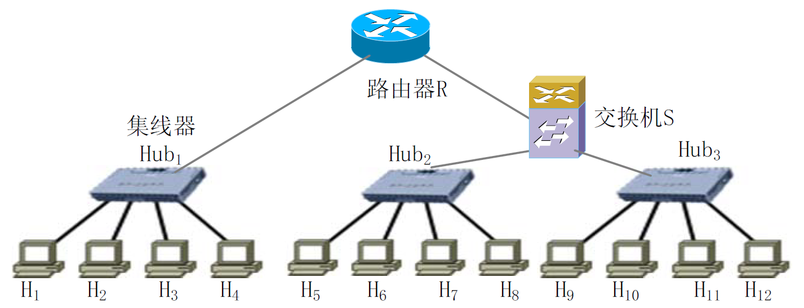

# hw 01

<h2>Overview</h2>

- 第 1 章: 1, 2, 4, 3, 6

- 第 2 章: 12, 9, 11, 13, 10, 7, 8

- 第 3-4 章: 5, 14

> 注意:
>
> 1. **单位问题**: 1KiB=1024B, 1KB=1000B.
>    "KiB" 即千位二进制字节 (kilo binary byte).
>    所以 1Kb 和 1kb 应该不分大小写都是 `1:1000` 的进制转换.
> 2. **传输层/运输层?** PPT 上都是传输层, 教材上都是运输层.
>    (这里指的都是 transport layer)

## Ex. 1

请从低至高依次写出 ISO/OSI RM 体系结构模型中每一层的名称.

### Solution

由低至高: 物理层, 数据链路层, 网络层, 传输层, 会话层, 表示层, 应用层.

> TCP/IP 协议是四层模型: 应用层, 运输层, 网际层, 网络接口层

## Ex. 2

计算机网络中的时延分为哪几种? 每种的意义是什么?

### Solution

| 时延种类 | 意义                                                                                       |
| -------- | ------------------------------------------------------------------------------------------ |
| 发送时延 | 发送数据时, 数据块从结点进入传输介质所需要的时间                                           |
| 传播时延 | 电磁波在信道中传播一定的距离需要花费的时间                                                 |
| 处理时延 | 主机或路由器在收到分组时进行一些必要的处理 (分析分组首部, 差错检验, 查找路由) 所花费的时间 |
| 排队时延 | 结点缓存队列中分组排队所经历的时延                                                         |

## Ex. 3

分别描述电路交换和分组交换的基本原理, 并分析说明计算机网络不采用电路交换的原因.

### Solution

电路交换: 是一种面向连接的交换, 建立连接后通过该连接传递信息.

> 信息如果采用电路交换, 就需要先建立连接以占用通信资源, 并在通话期间持续占用通信资源, 在通话结束后释放连接以归还通信资源.

分组交换: 核心在于对信息的分组转发.

> 采用分组交换传递信息时,
>
> 1. 发送端将报文划分为较短的定长的数据段, 每个数据段前面添加上控制信息等作为首部构成分组, 然后发送各分组;
> 2. 中间结点以存储转发的形式将分组依次逐跳转发到目的端;
> 3. 接收端收到分组后, 剥去分组的首部, 将数据恢复成为原本的报文.

## Ex. 4

数据长度为 $10^6$ bits, 数据发送速率为 100 kb/s, 收发两端之间的传输距离为 1000km, 信号在媒体上的传播速率为 $2\times 10^7$ m/s, 请分别计算数据的发送时延和传播时延.

### Solution

发送时延:

$$
T_{\text{send}} = \frac{10^6 {\rm bits}}{100{\rm kb/s}}=10 {\rm ms},
%0.00103515625
$$

传播时延:

$$
T_{\text{trans}} = \frac{1000 {\rm km}}{2\times 10^7 {\rm m/s}} = 50{\rm ms}
%1/20
$$

> 做的时候两个都算错了, 一个抄错了数据, 一个计算错了一位.

## Ex. 5

集线器, 网桥, 路由器, 网关是计算机网络中的常见设备类型, 请分别描述这四类设备的作用层次和主要功能.

### Solution

> 参考答案:
>
> **集线器**:
> **物理层**中间设备,
> 主要作用是在物理层中实现透明的二进制比特复制,
> 以补偿信号衰减/整形,
> 使用集线器相连接的所有结点仍然在同一个碰撞域
>
> **网桥**:
> **数据链路层**的中间设备,
> 主要作用是根据 MAC 帧的目的地址对收到的帧进行转发.
> 基于其过滤和转发帧功能,
> 网桥将其连接的各网段隔离为不同的碰撞域
>
> **路由器**:
> **网络层**的中间设备,
> 作用是根据 IP 分组的目的地址对收到的 IP 分组进行转发
>
> **网关**:
> **网络层以上的中间系统**,
> 作用是在高层进行协议的转换以连接两个不兼容的系统

| Item   | 作用层次   | 主要功能                                   |
| ------ | ---------- | ------------------------------------------ |
| 集线器 | 物理层     | 接收从某个端口输入的信号, 并向所有端口转发 |
| 网桥   | 数据链路层 | 扩展局域网, 根据 MAC 地址过滤/转发帧       |
| 路由器 | 网络层     | 实现分组转发, 为网络动态维护路由表         |
| 网关   | 网络层以上 | 协议转换, 从而实现异构网络互连             |

## Ex. 6

主机甲通过 1 个路由器 (存储转发方式) 与主机乙互联, 两段链路的数据传输速率均为 10Mbps, 主机甲分别采用报文交换和分组大小为 10 kb 的分组交换向主机乙发送 1 个大小为 7 Mb 的数据. 若忽略链路传播延迟, 头部开销和分组拆装时间, 则两种交换方式完成该数据传输所需的总时间分别为多少?

### Solution

**报文交换**:
主机甲向路由器发送整个 7Mb + 路由器向主机乙发送整个 7Mb

$$
t_{\text{g}}=\frac{\rm 7Mb}{\rm 10Mbps}\times 2=1400{\rm ms}
$$

**分组交换**: 主机甲发送第 2 个分组的同时,
路由器已经开始向主机乙转发第 1 个分组,
共 700 个分组.

$$
t_{\text{p}}=
\frac{\rm 7Mb}{\rm 10 Mbps}
+\frac{\rm 10kb}{\rm 10 Mbps}
={\rm 701ms}
$$

> 注意:
>
> 1M=1000k

## Ex. 7

共有 4 个节点进行码分多址 CDMA 通信. 假设 4 个节点的码片序列分别为:

```
A(-1+1-1-1-1-1+1-1)
B(-1-1-1+1+1-1+1+1)
C(-1-1+1-1+1+1+1-1)
D(-1+1-1+1+1+1-1-1)
```

现收到这样的码片序列

```
S(-1+1-3+3+1-1-1+1)
```

请问节点 A, B, C, D 发送数据的情况?

### Solution

由于各个节点分配的码片序列相互正交, 因此作如下的计算:

$$
%A -1+1-1-1-1-1+1-1
S\cdot A=\frac{1}{m}\sum_{i=1}^{m}S_iA_i
=\frac{1}{8}\times(1+1+3-3-1+1-1-1)=0
;\\
%B -1-1-1+1+1-1+1+1
S\cdot B=\frac{1}{m}\sum_{i=1}^{m}S_iB_i
=\frac{1}{8}\times(1-1+3+3+1+1-1+1)=1
;\\
%C -1-1+1-1+1+1+1-1
S\cdot C=\frac{1}{m}\sum_{i=1}^{m}S_iC_i
=\frac{1}{8}\times(1-1-3-3+1-1-1-1)=-1
;\\
%S -1+1-3+3+1-1-1+1
%D -1+1-1+1+1+1-1-1
S\cdot D=\frac{1}{m}\sum_{i=1}^{m}S_iD_i
=\frac{1}{8}\times(1+1+3+3+1-1+1-1)=1.
$$

因此, A 未发送数据, B 和 D 发送 1, C 发送 0.

## (※) Ex. 8

> 第二次做还懵了一下.

假定 1km 长的 CSMA/CD [^1] 网络的链路带宽为 1Gb/s, 设信号在链路上的传播速率是 200000km/s, 请问能够使用此协议的最短帧长为多少?

### Solution

> **提示**:
>
> Q: 为什么有 "最短帧长" ? 帧长太短了会发生什么?
>
> 记端到端的传播时延为 τ, 最先发送的站点最多经过 2τ 就可以知道是否发生了碰撞,
> 故称 **2τ** 为 **争用期** .
> 只有经过争用期之后还没有检测到碰撞, 才能肯定这次发送不会发生碰撞.
>
> 若帧长太短, 则还不知道是否发生碰撞就已经开始后续帧的发送, 这不好.
>
> 适当的帧长保证在数据帧发送完毕的时间不小于碰撞能够被检测到的时间,
> 也就是说, 帧长不小于 **发送速率 × 最大碰撞检测时间** (=带宽 ×RTT?)

信号在链路上的单程传播时间

$$
\tau=\frac{\rm 1km}{\rm 200000km/s}=5\mu s,
$$

因此最小帧发射时间不小于 $2\tau=10\mu s$, 故可以使用此协议的最短帧长为

$$
L_{\text{frame}}= 2\tau \times 1{\rm Gbps}=1\times 10^4 {\rm b},
$$

即 $10^4$ bit (or 10 kb).

## Ex. 9

对于带宽为 40kHz 的信道, 若有 4 种不同的物理状态来表示数据, 信噪比为 30dB. 按香农定理, 信道的最大传输数据速率是多少?

### Solution

信噪比单位转换: $30{\rm dB}=10 \lg (S/N)\ ({\rm dB})$, 故 $S/N=1000$.

应用香农公式:

$$
C= W\log_2 (1+S/N)
\\=40\times 10^3{\rm Hz}\times\log_2(1+1000)
\\\approx 398689.05{\rm bps}\approx 398.69{\rm kbps}
%398689.0503534397
$$

信道的最大传输数据速率约为 398.69kbps.

> 注意:
>
> 不是奈氏定理, 不需要考虑 "物理状态种类".

## Ex. 10

假设需要为卫星站的一条 1Mbps 的点到点链路设计一个滑动窗口协议, 卫星在 $3\times 10^4$ km 的高度绕地球同步旋转. 假设每帧携带 1KB 数据, 发送窗口大小和接收窗口大小一样 (RWS = SWS) , 请问需要多少比特作为标识数据帧的序号? (光速为 $3\times 10^8$ m/s)

### Solution

单程传播时延: (传播时延一般和物理介质之类的有关, 这里传播时延 τ=路程长度/光速)

$$
t_1=\frac{3\times10^4{\rm km}}{3\times10^8{\rm m/s}}=0.1{\rm s}
$$

每秒可以传输帧数: (秒传数据=带宽, 求帧数需要再除以帧的大小)

$$
\#(frame)=\frac{\rm 1Mbps\times 1s}{\rm 8\times10^3 bit}=125
$$

> **重点**:
> 怎么确定发送窗口大小呢?
>
> 答案: 避免发生碰撞, 需要保证帧传输时间不小于碰撞检测时间 2τ,
>
> 可以参考 [Ex. 8](#Ex-8).

可得发送窗口大小 (帧数):

$$
\text{SWS}=125\times0.1\times2=25
$$

> **重点**:
> 怎么根据窗口大小确定 MaxSeqNum 呢?
>
> 答案: `SWS+RWS < MaxSeqNum`.

由 $\text{SWS=RWS}$ 得 $\text{SWS}<\frac{\text{MaxSeqNum+1}}{2}$, 因此需要至少 50 个序号, 对应 $\lceil\log_2 50\rceil=6$ 个比特.

## Ex. 11

采用循环冗余校验技术作为差错检测方案, 要发送的数据为 `1101011011`, CRC 生成多项式是 $P(X)=X^4+X+1$.

1. 求应添加在数据后面的余数.
2. 若数据在传输过程中数据部分的最后两个 1 都变成了 0, 问接收端能否发现?
3. 采用 CRC 检验后, 数据链路层的传输是否就变成了可靠的传输?

### Solution

#### (1)

将 `11010110110000` 除以 `10011` , 得到 `1110` , 所以余数是 `1110` .

#### (2)

能发现, 因为 `11010110001110` 除以 `10011` 会得到余数 `101` , 也就是说不能整除.

#### (3)

不是. 采用 CRC 检验技术, 只能做到无差错接受, 使接受的帧在传输过程中基本不产生差错, 出错的帧会被接收方丢弃, 但可靠传输还要求能够恢复被丢弃的帧, 因此 CRC 检验技术加上合适的重传/恢复机制才能称为可靠传输.

> **参考答案**:
>
> 采用 CRC 检验后, 数据链路层的传输并没有成为可靠的传输.
> 差错检测技术只能帮助接收端实现无差错接收, 即通过检测判断消息无差错则接收该消息;
> 若判断该消息出错, 则丢弃该消息.
>
> 无比特差错与无传输差错不同,
> 差错检测技术并不能保证消息在传输过程中不发生帧丢失, 重复, 失序等错误,
> 消息的可靠传输需要通过停等算法, 滑动窗口算法等可靠传输机制实现.

## Ex. 12

直连网络是节点之间通过点对点/多路访问链路互联而形成的网络形态. 构建直连网络的关键技术包括: 信道编码, 组帧, 错误检测, 可靠传输, 介质访问控制. 请回答以下问题:

1. 分别简要描述上述各项关键技术的目的;
2. 针对每项关键技术, 给出 1 种典型的解决方案的名称并简要描述其设计原理.

### Solution

#### (1) 目的

> **参考答案**:
>
> 信道编码:
> 把比特编码后传送到物理传输介质（链路）上,
> 使其能被收方主机接收并理解,
> 如: 曼彻斯特编码
>
> 组帧:
> 将比特序列描述为完整的消息, 形成一个帧,
> 如: **起始标记法**
>
> 错误检测:
> 检测传输过程中出现的错误并采取适当行动,
> 如: CRC
>
> 可靠传输:
> 建立一个看起来可靠的链路,
> 如: 滑动窗口算法, 停等算法
>
> 介质访问控制:
> 一条链路由多个主机共享时,
> 协调主机对链路的访问,
> 如: CDMA, CSMA/CD

| 技术         | 目的                                                               |
| ------------ | ------------------------------------------------------------------ |
| 信道编码     | 将基带信号转换为**适用于信道传输**的信号                           |
| 组帧         | 将比特序列组织为帧, 以便在结点之间传送, 使数据能被接收, 提取和检错 |
| 错误检测     | 发现传输差错, 在发现错误时丢弃并重传, 保证数据传输的比特准确性     |
| 可靠传输     | 保证接收端收到的数据就是发送端发送的数据 (**可靠**)                |
| 介质访问控制 | 实现**信道复用**, 支持多点接入, 提高通信资源利用效率               |

#### (2)

| 技术         | 1 个解决方案                              | 方案原理                                                                                              |
| ------------ | ----------------------------------------- | ----------------------------------------------------------------------------------------------------- |
| 信道编码     | 差分曼彻斯特编码                          | 以相邻周期反相/同相标识 1/0, 消除直流分量, 方便提取时钟周期                                           |
| 组帧         | 高级数据链路控制协议 (HDLC), 面向比特组帧 | 将帧看作比特集, 使用标志字段来标识首位, 使用比特填充法避免标识字段引起歧义                            |
| 错误检测     | 循环冗余校验 (CRC)                        | 利用有限域 (模 2) 上多项式, 在数据末尾加上余数扩展消息, 通过在接收端检测除以生成多项式是否整除来检错  |
| 可靠传输     | 滑动窗口算法                              | 在窗口大小的范围内: (1)发送端保持信道满载, 并发传输数据; (2) 接收端确认接收到的数据, 超时请求重发数据 |
| 介质访问控制 | CSMA                                      | 广播链路多点接入, 结点在发送前检测信道是否忙碌来决定是否发送, 尽力避免碰撞.                           |

## Ex. 13

停等算法 (stop and wait) 和滑动窗口算法 (sliding window) 是实现可靠传输的典型机制, 请回答以下问题:

1. 描述停等算法的基本原理;
2. 分析停等算法在数据传输效率方面存在的问题;
3. 描述滑动窗口算法的基本原理, 并分析滑动窗口算法能够提升数据传输效率的原因.

### Solution

#### (1)

停等算法的基本原理:

1. (停等) 发送方传输一帧后, 等到接收方发送一个对该帧的 ACK 后再传输下一帧;
2. (重传) **如果 ACK 在一段时间后没有到达, 发送方认为超时, 重新发送该帧**.

#### (2)

1. 停等算法下, 链路上只允许有一个未确认的帧, 造成链路容量大量空闲.

\*2. 如果超时时长设置不合理, 会导致发送方反复发送重复帧, 造成通信资源浪费.

#### (3)

滑动窗口算法的基本原理:

1. **发送方**缓存 SWS 个帧, 并发传输多个帧:
   1. 维护发送窗口大小 SWS, 最近被确认帧 LAR 和最近发送帧 LFS;
   2. 收到 ACK 后右移窗口更新 LAR, 窗口允许时发送新的帧, 更新 LFS;
   3. 为每帧设置定时器, 若收到 ACK 前超时则重传该帧
2. **接收方**只落在接收窗口内的帧, 并将最大连续帧 SeqNum 作为 Ack 回复:
   1. 维护接收窗口大小 RWS, 最大可接收帧 LAF, 最后确认接收帧 LFR;
   2. 收到帧时, 如果帧在窗口内 (LFR≤SeqNum≤LAF) 则接收, 否则丢弃; 将收到的最大连续数据帧的 SeqNum 作为 ACK 回复发送方.

滑动窗口算法**允许链路上有某个数量以内的未确认帧**, 这是它对停等算法最显著的改进, 这使得链路容量能够被充分利用, 从而提升了数据传输效率. (因为发送窗口里的分组可以不需要等待对方确认直接连续发送)

## Ex. 14

下图中包含三类网络节点: 集线器, 交换机, 路由器.



请回答以下问题:

1. 简述交换机和路由器分别工作于网络体系结构中的哪一层, 其基本功能是什么?
2. 这个网络中有几个冲突域, 几个广播域?

### Solution

#### (1)

| Item   | 层次       | 基本功能                                                                   |
| ------ | ---------- | -------------------------------------------------------------------------- |
| 交换机 | 数据链路层 | (对接入交换机的结点,) 根据 **MAC 帧** 的目的地址决定向何端口转发, 能够隔离碰撞域  |
| 路由器 | 网络层     | (接收 IP 分组,) 根据 **IP 分组** 目的地址决定该分组的转发路由 (下一跳往哪个路由器/目的主机转发), 能够隔离广播域和碰撞域 |

#### (2)

该网络中有 3 个冲突域 (碰撞域), 2 个广播域.

## Reference

1. [如何通俗地解释什么是网桥？ - 肖宏辉的回答 - 知乎](https://www.zhihu.com/question/67473683/answer/254496942)
2. [老司机解读香农定理, 奈奎斯特定理, 编码与调制 - 微波基础知识 - 微波射频网](http://www.mwrf.net/tech/basic/2018/24694.html)

<!--以下 Footnotes-->

[^1]: (CSMA/CD) 即带碰撞检测的 CSMA. CSMA 即 "载波侦听多点接入".
